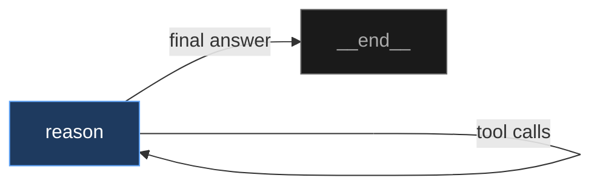
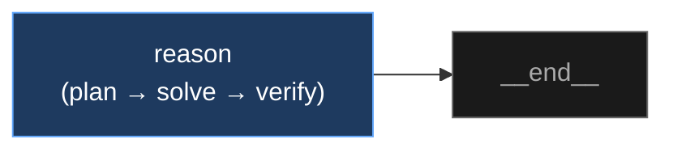
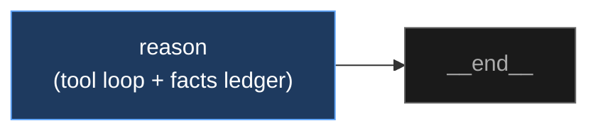
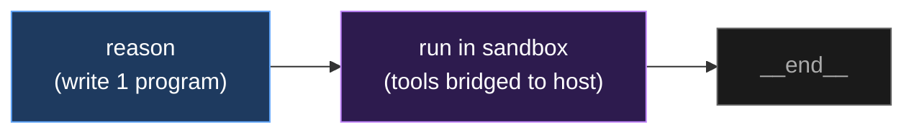
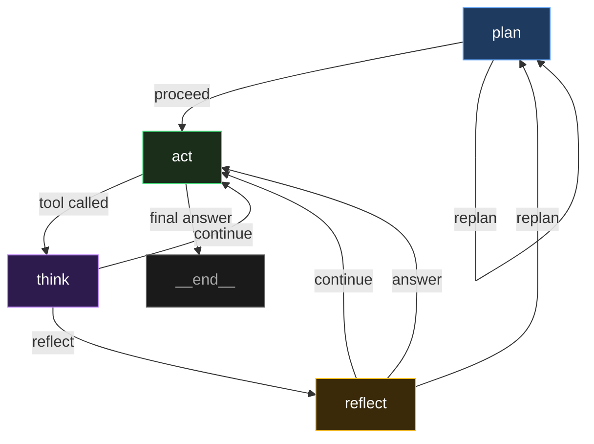
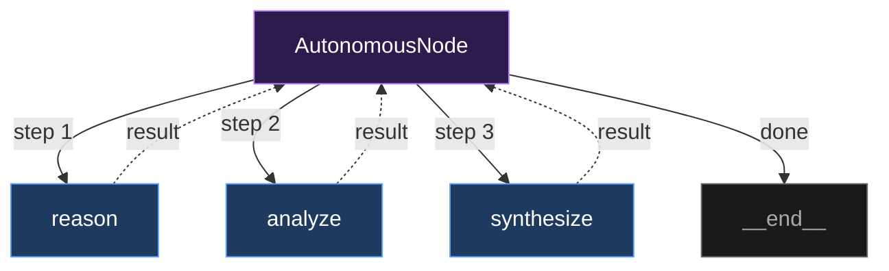
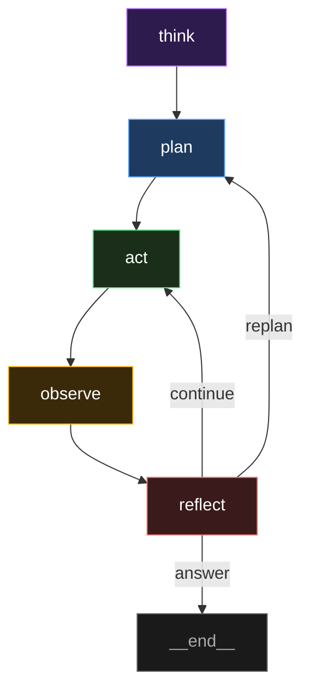
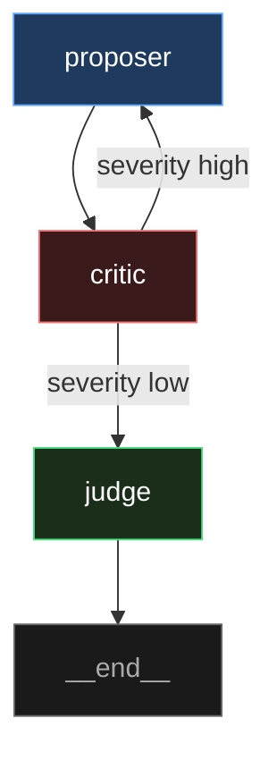
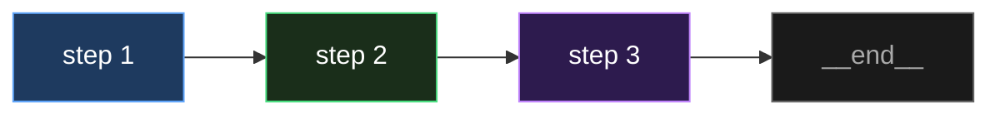
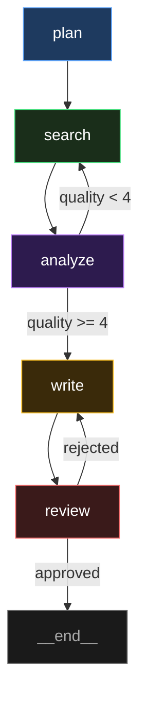

# Prebuilt Patterns

Ten ready-to-use reasoning patterns. Each factory function returns a configured `PromptGraph`. Use as `agent_pattern` in `build_agent()` or pass directly to `PromptGraphEngine`.

## ReAct (Default)

Single PromptNode with tools. The LLM decides when to call tools and when to answer.



```python
agent = await build_agent(model="openai:gpt-5-mini", servers=my_servers)
# or explicitly:
agent = await build_agent(..., agent_pattern="react")
```

The engine loops: LLM → tools → LLM → tools → ... → final answer.

```python
PromptGraph.react(
    tools=None,              # LangChain BaseTool instances
    system_prompt="",        # System prompt text
    blocks=None,             # PromptBlock objects
    max_node_iterations=15,  # Max tool-calling loops
)
```

## Verify (single-pass self-checking)

A single LLM call in which the model must **plan, solve, and verify its own
answer** before responding. It adds the accuracy benefit of an explicit
self-verification step at **one-turn latency** — no multi-call overhead.



```python
agent = await build_agent(..., agent_pattern="verify")
```

```python
PromptGraph.verify(
    tools=None,
    system_prompt="",
    blocks=None,
    max_node_iterations=6,
)
```

!!! note "When it helps"
    The forced self-check lifts accuracy over a plain direct prompt on **weak
    and mainstream models** at one-turn latency. A *frontier* model that
    already reasons strongly internally is typically at its ceiling with a
    direct prompt, so `verify` there only adds a cheap safety check rather than
    more accuracy. On a capable model it is **comparable to**, not strictly
    better than, a well-prompted ReAct pass. For multi-stage deliberate
    reasoning with per-stage context scoping, compose a custom graph (see
    *Custom Graph*).

## Managed (context-managed tool loop)

For **deep multi-tool tasks** — traversing a database or graph, gathering
many facts then aggregating. A single tool-using node run with
`context_scope="ledger"`: instead of feeding the model an ever-growing
transcript of tool calls and results (where it loses track and re-queries the
same facts), each turn it sees the task, its most recent exchange, and a
compact **deduplicated "facts gathered" ledger**. Identical `(tool, args)`
calls are also served from cache rather than re-executed.



```python
agent = await build_agent(..., agent_pattern="managed")
```

```python
PromptGraph.managed(
    tools=my_tools,
    system_prompt="",
    blocks=None,
    max_node_iterations=30,   # deep tasks make many calls
)
```

The underlying primitive is [`PromptNode(context_scope="ledger")`](engine-nodes.md#context-scope),
which any custom graph can use on a long-running tool node.

!!! note "What it does, honestly"
    On deep tool chains a *naive* ReAct loop re-queries the same facts many
    times as its transcript grows — dozens of redundant calls for a handful of
    distinct facts. The ledger **bounds context and cuts redundant tool calls**
    at **equal accuracy** — a real cost/latency win on long chains. It is an
    **efficiency** primitive: it does not by itself make the model's final
    answer more correct.

## Code-Action (one sandboxed program)

For **aggregation / data-traversal tasks**, the model writes **one Python
program** over your tools in a single LLM turn — instead of chaining dozens of
conversational tool calls. The program runs in Promptise's hardened Docker
sandbox; its tool calls bridge back to the real host tools, so the model gets
code's exactness (loops, sums, filters, joins) while every tool call still
keeps its protections — approval gates if configured, plus budget/health/audit
hooks when the Agent Runtime has attached them — and the node enforces a hard
`max_tool_calls` cap per run regardless.



```python
agent = await build_agent(..., agent_pattern="code-action")  # sandbox auto-enabled
```

```python
PromptGraph.code_action(
    tools=my_tools,
    system_prompt="",
    blocks=None,
    sandbox_factory=...,   # injected by build_agent
    max_repairs=1,         # re-try once on a crash, feeding stderr back
    exec_timeout=120,      # max seconds the program may run
)
```

**The mechanism.** In one turn the model writes a program that calls your tools
as ordinary Python functions. Inside the sandbox those functions are RPC stubs:
each writes a request to the workspace; a concurrent host loop runs the *real*
tool and writes back the response. The sandbox has a **read-only rootfs, dropped
capabilities, and no network** — the program's only outside reach is your
bridged tools.

!!! warning "Requirements & honest scope"
    Requires **Docker** (auto-enabled for this pattern). It shines when your
    tools return **structured data** (lists/dicts/numbers) the program can use
    directly, and on tasks a conversational loop gets wrong by re-querying and
    mis-aggregating. It is a *pattern, not a replacement* — for ambiguous or
    conversational tasks prefer `react`/`managed`. Validated end-to-end on a
    real sandbox + real model (see `tests/test_code_action_integration.py`).

## PEOATR

Plan → Act → Think → Reflect. Four-stage structured reasoning with specialized nodes.



```python
agent = await build_agent(..., agent_pattern="peoatr")
```

```python
PromptGraph.peoatr(
    tools=None,                    # Tools for the act node
    system_prompt="",              # Shared system prompt
    blocks=None,                   # Shared blocks
    planning_instructions="",     # Extra instructions for the plan node
    acting_instructions="",       # Extra instructions for the act node
    thinking_instructions="",     # Extra instructions for the think node
    reflecting_instructions="",   # Extra instructions for the reflect node
)
```

Each stage has its own role:

- **Plan** (PlanNode) — Create subgoals, self-evaluate quality, reject bad plans
- **Act** (PromptNode) — Execute tools to achieve the active subgoal
- **Think** (ThinkNode) — Analyze tool results, check if subgoal is complete
- **Reflect** (ReflectNode) — Evaluate progress, route to continue/replan/answer

## Research

Search → Verify → Synthesize. Three-stage research pipeline with optional verification.


```python
agent = await build_agent(..., agent_pattern="research")
```

```python
PromptGraph.research(
    search_tools=None,       # Tools for the search node
    synthesis_tools=None,    # Tools for the synthesize node (optional)
    system_prompt="",        # Shared system prompt
    blocks=None,             # Shared blocks
    verify=True,             # Include verification step (set False to skip)
)
```

Verification loops back to search until findings pass quality gates.

## Autonomous

Agent receives a pool of configured nodes and dynamically decides which to execute at each step.



```python
agent = await build_agent(..., agent_pattern="autonomous")
```

```python
PromptGraph.autonomous(
    node_pool=None,          # List of BaseNode instances to choose from
    system_prompt="",        # System prompt for the planner
    tools=None,              # Default tools (used if no pool provided)
    max_steps=15,            # Maximum autonomous decision steps
)
```

The LLM sees the node catalog (names, descriptions, flags) and picks the best step at each iteration. If no pool is provided, default reason/analyze/synthesize nodes are created from the tools.

## Deliberate

Think → Plan → Act → Observe → Reflect. Slower, higher-quality reasoning that thinks before acting and observes results carefully.



```python
agent = await build_agent(..., agent_pattern="deliberate")
```

```python
PromptGraph.deliberate(
    tools=None,              # Tools for the act node
    system_prompt="",        # Shared system prompt
)
```

Uses reasoning nodes: ThinkNode → PlanNode → PromptNode (with tools) → ObserveNode → ReflectNode.

## Debate

Adversarial two-agent debate. Proposer and critic alternate until consensus.



```python
agent = await build_agent(..., agent_pattern="debate")
```

```python
PromptGraph.debate(
    system_prompt="",        # Shared system prompt
    max_rounds=5,            # Maximum debate rounds before judge decides
)
```

Uses CritiqueNode for the critic and ValidateNode for the judge. The proposer generates, the critic challenges, and the judge renders a final verdict.

## Pipeline

Simple sequential pipeline. Chains provided nodes with always edges. No loops, no conditions.



```python
from promptise.engine import PromptGraph, PromptNode

graph = PromptGraph.pipeline(
    PromptNode("extract", instructions="Extract key facts."),
    PromptNode("analyze", instructions="Analyze the facts."),
    PromptNode("format", instructions="Format the results."),
)
agent = await build_agent(..., agent_pattern=graph)
```

```python
PromptGraph.pipeline(
    *nodes: BaseNode,        # Variadic: nodes to chain sequentially
)
```

Automatically sets the first node as entry. The last node defaults to `__end__`.

## Custom Graph

Build any topology. Pass directly to `build_agent()`.



```python
from promptise.engine import PromptGraph, PromptNode, GuardNode
from promptise.engine.skills import planner, web_researcher, summarizer

graph = PromptGraph("custom", mode="static")
graph.add_node(planner("plan"))
graph.add_node(web_researcher("search", tools=search_tools))
graph.add_node(PromptNode("analyze", instructions="Analyze findings.", output_key="analysis"))
graph.add_node(summarizer("write"))
graph.add_node(GuardNode("review", on_pass="__end__", on_fail="write"))

graph.always("plan", "search")
graph.always("search", "analyze")
graph.when("analyze", "write", lambda r: (r.output or {}).get("quality", 0) >= 4)
graph.when("analyze", "search", lambda r: (r.output or {}).get("quality", 0) < 4)
graph.always("write", "review")

graph.set_entry("plan")
agent = await build_agent(..., agent_pattern=graph)
```
