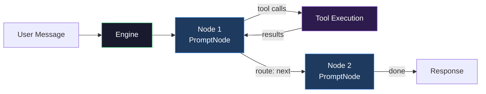
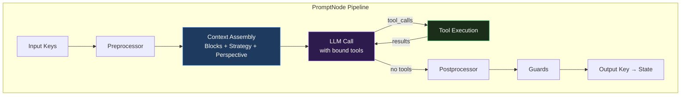

# Reasoning Graph

The Reasoning Graph is Promptise's agent execution engine — a directed graph of composable reasoning nodes where every node is a complete processing pipeline with its own blocks, tools, guards, strategy, context layers, and data flow ports.

## How It Works



Each node is a full pipeline:



## Two Modes

### Autonomous (Default) — Agent Builds Its Own Path

Give the agent a pool of nodes. It decides which to run and in what order.

```python
from promptise import build_agent
from promptise.engine import PromptGraph, PromptNode, PlanNode, ThinkNode, ReflectNode, SynthesizeNode

agent = await build_agent(
    model="openai:gpt-5-mini",
    servers=my_servers,
    agent_pattern=PromptGraph("my-agent", nodes=[
        PlanNode("plan", is_entry=True),
        PromptNode("act", inject_tools=True),
        ThinkNode("think"),
        ReflectNode("reflect"),
        SynthesizeNode("answer", is_terminal=True),
    ]),
)
```

Each node is fully pre-configured — the developer just picks the building bricks:

- **PlanNode** — Creates subgoals, self-evaluates quality, re-plans if below threshold
- **ThinkNode** — Analyzes gaps, recommends next step, no tools
- **ReflectNode** — Self-evaluation, identifies mistakes, stores corrections
- **SynthesizeNode** — Combines all findings into final answer
- **PromptNode** with `inject_tools=True` — Gets MCP tools at runtime, the only node that calls tools

### Static (Opt-in) — Developer Wires Edges

```python
graph = PromptGraph("pipeline", mode="static")
graph.add_node(PlanNode("plan"))
graph.add_node(PromptNode("act", inject_tools=True))
graph.add_node(SynthesizeNode("answer"))
graph.sequential("plan", "act", "answer")
graph.set_entry("plan")

agent = await build_agent(..., agent_pattern=graph)
```

## Quick Start Patterns

```python
# String patterns
agent = await build_agent(..., agent_pattern="react")       # Default tool-calling loop
agent = await build_agent(..., agent_pattern="verify")      # Plan → Solve → Self-check (1 turn)
agent = await build_agent(..., agent_pattern="managed")     # Tool loop with facts-ledger context
agent = await build_agent(..., agent_pattern="peoatr")      # Plan → Act → Think → Reflect
agent = await build_agent(..., agent_pattern="research")    # Search → Verify → Synthesize
agent = await build_agent(..., agent_pattern="autonomous")  # Agent builds own path
agent = await build_agent(..., agent_pattern="deliberate")  # Think → Plan → Act → Observe → Reflect
agent = await build_agent(..., agent_pattern="debate")      # Proposer ↔ Critic → Judge

# Or pass a PromptGraph directly
agent = await build_agent(..., agent_pattern=my_graph)

# Or pass a node pool
agent = await build_agent(..., node_pool=[PlanNode("plan", is_entry=True), ...])
```

## Architecture

```
Reasoning Graph Engine
│
├─ Nodes ─────────────────────────────────────────────────────────
│  │
│  ├─ Standard (10 types)
│  │  ├─ Core
│  │  │  ├── PromptNode              LLM reasoning with full pipeline
│  │  │  ├── ToolNode                Explicit tool execution
│  │  │  └── TransformNode           Pure data transformation (no LLM)
│  │  │
│  │  ├─ Flow Control
│  │  │  ├── RouterNode              LLM-based dynamic routing
│  │  │  ├── GuardNode               Validate and gate with pass/fail
│  │  │  ├── LoopNode                Repeat until condition met
│  │  │  └── HumanNode              Pause for human approval
│  │  │
│  │  └─ Composition
│  │     ├── ParallelNode            Run children concurrently
│  │     ├── SubgraphNode            Embed a complete sub-graph
│  │     └── AutonomousNode          Agent picks from node pool
│  │
│  ├─ Reasoning (10 pre-built)
│  │  ├─ Analysis
│  │  │  ├── ThinkNode               Gap analysis, confidence scoring
│  │  │  ├── ObserveNode             Tool result interpretation
│  │  │  └── CritiqueNode            Adversarial self-review
│  │  │
│  │  ├─ Planning & Reflection
│  │  │  ├── PlanNode                Structured planning with subgoals
│  │  │  ├── ReflectNode             Self-evaluation, mistake correction
│  │  │  └── JustifyNode             Audit trail justification
│  │  │
│  │  ├─ Output
│  │  │  ├── SynthesizeNode          Final answer composition
│  │  │  └── ValidateNode            LLM-powered quality validation
│  │  │
│  │  └─ Orchestration
│  │     ├── RetryNode               Retry wrapper with backoff
│  │     └── FanOutNode              Parallel sub-questions
│  │
│  └─ Custom
│     ├── @node decorator             Any async function → node
│     └── BaseNode subclass           Full custom behavior
│
├─ Edges & Transitions ──────────────────────────────────────────
│  │
│  ├─ Unconditional
│  │  ├── always()                    A always goes to B
│  │  └── sequential()               Chain A → B → C → ...
│  │
│  ├─ Conditional
│  │  ├── when()                      Custom predicate
│  │  ├── on_tool_call()              When tools were called
│  │  ├── on_no_tool_call()           When no tools (final answer)
│  │  ├── on_output()                 When output key matches value
│  │  ├── on_error()                  When node errors
│  │  ├── on_confidence()             When confidence >= threshold
│  │  └── on_guard_fail()             When any guard fails
│  │
│  ├─ Loop
│  │  └── loop_until()                Repeat until condition, then exit
│  │
│  └─ Dynamic (LLM-directed)
│     └── output.route                LLM names next node at runtime
│
├─ Flags (16 typed) ─────────────────────────────────────────────
│  │
│  ├─ Execution Control
│  │  ├── ENTRY / TERMINAL            Graph start and end markers
│  │  ├── CRITICAL                    Abort graph on error
│  │  ├── SKIP_ON_ERROR               Skip if previous node errored
│  │  ├── RETRYABLE                   Retry with exponential backoff
│  │  └── REQUIRES_HUMAN              Flag for human input
│  │
│  ├─ Context & Memory
│  │  ├── NO_HISTORY                  Strip conversation messages
│  │  ├── ISOLATED_CONTEXT            Clean context, merge back output only
│  │  └── CACHEABLE                   Cache result by input keys
│  │
│  ├─ Model Selection
│  │  ├── INJECT_TOOLS                Receive MCP tools at runtime
│  │  └── LIGHTWEIGHT                 Use smaller model for this node
│  │
│  ├─ Observability
│  │  ├── OBSERVABLE                  Emit detailed metrics to hooks
│  │  └── VERBOSE                     Full output in logs
│  │
│  ├─ Output Processing
│  │  ├── SUMMARIZE_OUTPUT            LLM-summarize long outputs
│  │  └── VALIDATE_OUTPUT             Validate against output_schema
│  │
│  └─ Concurrency & State
│     ├── READONLY / STATEFUL         Read-only vs state-modifying
│     └── PARALLEL_SAFE               Safe for concurrent execution
│
├─ Pipeline Processing ──────────────────────────────────────────
│  │
│  ├─ Preprocessors (before LLM call)
│  │  ├── context_enricher            Add timestamp, iteration info
│  │  ├── state_summarizer            Truncate long context values
│  │  └── input_validator             Require context keys
│  │
│  ├─ Postprocessors (after LLM call)
│  │  ├── json_extractor              Parse JSON from LLM output
│  │  ├── confidence_scorer           Score hedging language
│  │  ├── state_writer                Write output fields to context
│  │  └── output_truncator            Cap output length
│  │
│  └─ Combinators
│     ├── chain_preprocessors()       Compose N preprocessors
│     └── chain_postprocessors()      Pipe output through N functions
│
├─ Hooks & Observability ────────────────────────────────────────
│  │
│  ├─ Logging & Debugging
│  │  ├── LoggingHook                 Per-node execution logs
│  │  └── CycleDetectionHook          Detect and break infinite loops
│  │
│  ├─ Performance
│  │  ├── TimingHook                  Per-node time budgets
│  │  └── MetricsHook                 Collect calls, tokens, latency
│  │
│  ├─ Cost Control
│  │  └── BudgetHook                  Token and USD budget enforcement
│  │
│  └─ Reporting
│     ├── ExecutionReport             Per-run summary (iterations, tokens, path)
│     └── NodeResult                  Per-node trace (30+ fields)
│
├─ Prebuilt Patterns (9) ────────────────────────────────────────
│  │
│  ├─ Simple
│  │  ├── react                       Single node with tools (default)
│  │  └── pipeline                    Sequential chain
│  │
│  ├─ Context-Managed (single node)
│  │  ├── verify                      Plan → Solve → Self-check (1 turn)
│  │  └── managed                     Tool loop with deduplicated facts ledger
│  │
│  ├─ Structured Reasoning
│  │  ├── peoatr                      Plan → Act → Think → Reflect
│  │  ├── deliberate                  Think → Plan → Act → Observe → Reflect
│  │  └── research                    Search → Verify → Synthesize
│  │
│  └─ Advanced
│     ├── autonomous                  Agent builds own path from pool
│     └── debate                      Proposer ↔ Critic → Judge
│
├─ Skills Library (15 factories) ─────────────────────────────────
│  │
│  ├─ Standard Skills
│  │  ├── web_researcher              Search + cite sources
│  │  ├── code_reviewer               Security, performance, best practices
│  │  ├── data_analyst                Evidence-based, quantified claims
│  │  ├── fact_checker                Verification guard
│  │  ├── summarizer                  Concise synthesis
│  │  ├── planner                     Step-by-step planning
│  │  ├── decision_router             LLM-based routing
│  │  └── formatter                   Data transformation
│  │
│  └─ Reasoning Skills
│     ├── thinker                     ThinkNode factory
│     ├── reflector                   ReflectNode factory
│     ├── critic                      CritiqueNode factory
│     ├── justifier                   JustifyNode factory
│     ├── synthesizer                 SynthesizeNode factory
│     ├── validator_node              ValidateNode factory
│     └── observer_node               ObserveNode factory
│
└─ Serialization ─────────────────────────────────────────────────
   ├── save_graph() / load_graph()    YAML file persistence
   ├── graph_to_config()              Graph → dict
   ├── graph_from_config()            Dict → graph
   └── register_node_type()           Custom types for YAML
```

## Performance

The engine adds **<0.02ms overhead** per invocation (excluding LLM latency). Key optimizations:

- **O(1) edge resolution** — precomputed adjacency index, rebuilt lazily on mutation
- **Auto tool schema injection** — tool-using nodes auto-inject parameter names, types, and descriptions into the system prompt for better accuracy
- **Parallel tool execution** — 2+ tool calls in one LLM response execute concurrently
- **Cached system prompts** — on tool-loop re-entries, the system message + model binding are reused
- **Cached tool maps** — tool name→instance dict built once per node execution
- **Zero data truncation** — full tool results flow through (no arbitrary character limits)

See [OPTIMIZATIONS.md](https://github.com/promptise-com/foundry/blob/main/OPTIMIZATIONS.md) for full technical details and benchmarks.

## Runtime Tool Injection

Nodes with `inject_tools=True` receive MCP tools at runtime:

```python
PromptNode("search", inject_tools=True)  # Gets all MCP tools at runtime
ThinkNode("think")                        # No tools (pre-configured)
```

## Dynamic LLM Routing

Every node can route dynamically. The LLM outputs a `route` field:

```python
# LLM outputs: {"route": "search"} → engine goes to "search" node
```

## Runtime Graph Mutation

The LLM can modify the graph during execution — add nodes, skip to nodes, change context.

## Next Steps

- [Nodes](engine-nodes.md) — All 20 node types with full parameter reference
- [Edges & Transitions](engine-edges.md) — 10 edge helpers, transition resolution, LLM routing
- [Node Flags](engine-flags.md) — 16 typed flags controlling execution, caching, error handling
- [Processors](engine-processors.md) — Pre/post processors for data transformation
- [Runtime Tool Injection](engine-tools.md) — How MCP tools flow into nodes
- [Hooks & Observability](engine-hooks.md) — 5 hooks, execution reports, per-node metrics
- [Prebuilt Patterns](engine-prebuilts.md) — 9 ready-to-use patterns with Mermaid diagrams
- [Skills Library](engine-skills.md) — 15 pre-configured node factories
- [Serialization](engine-serialization.md) — YAML load/save
- [Building Custom Reasoning](../guides/custom-reasoning.md) — Step-by-step guide
