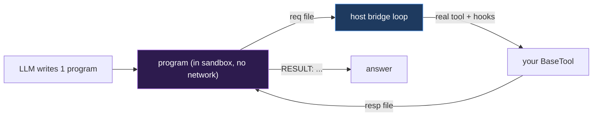

# Code-Action: one program beats a 20-call tool loop

For tasks that **gather many facts and then compute** — sum a department's
salaries, average a metric across a graph, join records across sources — a
conversational tool loop is the wrong tool. The transcript grows on every call,
the model loses the thread, re-queries the same facts, and aggregates them
unreliably in its head. Costs climb, latency climbs, accuracy drops.

`agent_pattern="code-action"` changes the **action space**: in a single LLM turn
the model writes **one Python program** over your tools and runs it in a sandbox.
Code computes exactly — loops, sums, filters, joins — so the answer is
deterministic, cheap, and fast.

!!! info "Runnable example"
    [`examples/reasoning/code_action_agent.py`](https://github.com/promptise-com/foundry/blob/main/examples/reasoning/code_action_agent.py)
    — real LLM, real Docker. Set `OPENAI_API_KEY` and have Docker running.

## Quick start

```python
from promptise import build_agent
from langchain_core.tools import tool

@tool("list_employees")
def list_employees() -> list:
    """Return a list of every employee name."""
    return [...]

@tool("get_employee")
def get_employee(name: str) -> dict:
    """Return {name, department, salary} for an employee."""
    return {...}

agent = await build_agent(
    servers={},                          # or your MCP servers
    model="openai:gpt-5-mini",
    agent_pattern="code-action",         # sandbox auto-enabled (Docker required)
    extra_tools=[list_employees, get_employee],
)

result = await agent.ainvoke({"messages": [{"role": "user", "content":
    "What is the combined salary of everyone in Engineering?"}]})
# → the model writes ONE program: list → look up each → filter → sum → print.
```

## When to use it

| Use code-action | Use `react` / `managed` instead |
|---|---|
| Sums, averages, counts over a dataset | Open-ended Q&A |
| Multi-hop joins / graph traversal | Ambiguous or conversational tasks |
| "Gather N facts, then compute" | A single tool call answers it |
| You can run Docker | No container runtime available |

It is a **pattern, not a replacement**. On tasks that are genuinely
conversational, a normal loop is better.

## Best practice: structured tools

Code-action is at its best when your tools return **structured data** — lists,
dicts, numbers — that the program can use directly:

```python
@tool("get_employee")
def get_employee(name: str) -> dict:          # ✅ program does emp["salary"]
    return {"name": name, "department": "Engineering", "salary": 210000}

@tool("get_employee")
def get_employee(name: str) -> str:           # ⚠️ program must parse prose
    return f"{name}: department=Engineering; salary=210000"
```

The bridge preserves JSON-serializable return values, so a tool that returns a
`dict` arrives in the program as a `dict` (not a stringified blob). Prose-string
tools still work — the model is told to parse them — but structured returns are
more reliable.

## The security model

The model writes code, so the code runs **contained**:

- **Hardened sandbox** — the program executes in Promptise's Docker sandbox:
  read-only rootfs, dropped capabilities, seccomp, resource limits, and
  **`network="none"`** (auto-set for this pattern).
- **No direct host access** — the program's *only* reach to the outside world is
  your tools, via the bridge. It can't touch the host filesystem or network.
- **Tools stay governed** — each bridged tool call invokes the real
  `BaseTool` on the host **through the engine's hooks**, so your Budget, Health,
  and audit governance apply to every call exactly as in a normal loop. A
  program cannot loop a destructive tool past its budget.



## How the bridge works

The program runs inside the container while a host loop services its tool calls
over the writable `/workspace` tmpfs:

1. The generated `promptise_tools.py` turns each of your tools into a stub: it
   writes a request file (`req_<id>.json`) and blocks.
2. A concurrent **host** loop sees the request, runs the *real* tool (with
   hooks), and writes the response (`resp_<id>.json` + a `.done` marker so reads
   never race a partial write).
3. The stub unblocks and returns the value to the program.

No network is involved — the channel is the shared filesystem, which is why the
sandbox can stay fully network-isolated.

## Repair on failure

If the program crashes, code-action feeds the **stderr** back to the model for a
bounded number of fixes (`max_repairs`, default 1) before giving up. This
recovers the common "off-by-one in the parsing" class of errors without an
unbounded loop.

## Configuration

```python
from promptise.engine import PromptGraph

PromptGraph.code_action(
    tools=my_tools,
    system_prompt="",
    sandbox_factory=...,   # injected by build_agent; supply your own for custom graphs
    max_repairs=1,         # stderr-driven self-repair attempts
    exec_timeout=120,      # seconds the program may run inside the sandbox
)
```

## Honest limits

- **Needs Docker.** `build_agent(agent_pattern="code-action")` raises a clear
  error if a sandbox can't be initialized — there is no silent fallback, because
  running model-written code outside a sandbox would be unsafe.
- **Latency floor.** Each run spins a fresh container (~1–2s). The token and
  accuracy wins dominate on real aggregation tasks, but for a one-shot lookup a
  plain `react` call is snappier.
- **Not magic on reasoning.** Code-action makes the *computation* exact; it does
  not make the model's *plan* smarter. If the task is ambiguous, clarify it
  first.

## See also

- [Reasoning Patterns](../core/agents/reasoning-patterns.md) — all 10 built-in patterns
- [Prebuilt Patterns](../core/engine-prebuilts.md#code-action-one-sandboxed-program) — the factory
- [Context Lifecycle Management](context-lifecycle.md) — the broader cost/rot story
- [Sandbox](../core/sandbox.md) — the container security layers code-action runs on
