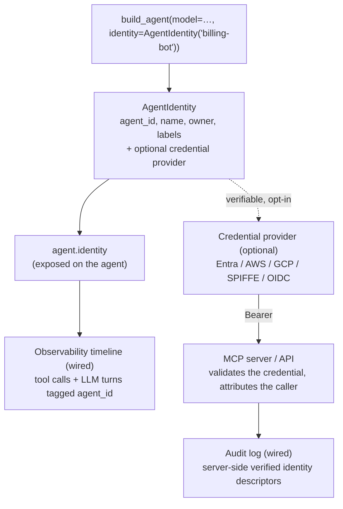

# Architecture

Agent Identity has two jobs: **attribute** every action to the acting
agent, and (optionally) **present** a verifiable credential to the
resources the agent calls. The identity itself is a small object; the
value is in where it flows.

## Attribution path



When you pass `identity=` to `build_agent`, the agent's `agent_id`
becomes the default attribution id for the observability timeline
(unless you set `observer_agent_id` explicitly). No further wiring is
needed — the observability subsystem already records every tool call and
LLM turn with an `agent_id`; identity just supplies it.

On the **server** side, the Guardrails `AuditMiddleware` records the
**verified** caller's identity descriptors — `subject` / `issuer` /
`audience` / `roles`, taken from the validated JWT — inside each
tamper-evident, HMAC-chained audit entry. Only identity *descriptors* are
recorded, never the token or the full claim set (which may carry
sensitive data). So server-side audit answers *which agent did what*, not
just a `client_id` string.

## Two tiers

- **Local** — `AgentIdentity("billing-bot", …)`. Pure attribution; needs
  no infrastructure. Used to tag traces and audit entries.
- **Verifiable** — `AgentIdentity.from_entra(...)` (or `from_aws`,
  `from_gcp`, `from_spiffe`, `from_oidc`, `auto`). Adds a credential
  provider that mints a signed JWT proving the identity, for resources
  that must authenticate the caller rather than trust a self-asserted id.

## Credential lifecycle

A verifiable identity's credential is a short-lived JWT. The framework
caches one credential **per audience** per provider and re-acquires it as
it nears expiry:

- The expiry is read from the JWT's standard `exp` claim
  (`decode_jwt_expiry`); a credential is re-acquired once it is within
  `CREDENTIAL_REFRESH_BUFFER_SECONDS` (60s) of expiry.
- A credential with no decodable `exp` — an opaque token, or a
  file-projected token rotated in place by the platform — is treated as
  always-stale and re-acquired on every use, so rotation is always
  observed.

Concurrent callers collapse into a single acquisition via a lock, and
the cache is process-local.

## Per-resource credentials

One agent often calls several resources — a billing MCP server, a CRM
API — and each may require a credential minted for *its* audience. A
verifiable identity serves all of them from a single `AgentIdentity`:

```python
identity.get_credential()                      # the provider's default audience
identity.get_credential("api://billing")       # scoped to the billing resource
identity.auth_header("api://crm")              # {"Authorization": "Bearer <jwt for crm>"}
```

What `audience` does depends on the provider:

| Provider kind | Providers | `audience=` behaviour |
| --- | --- | --- |
| **Active** (re-mints on demand) | Entra IMDS, AWS STS, GCP metadata, SPIFFE SDK | Mints a credential scoped to the requested audience; falls back to the factory default when omitted. |
| **Passive** (fixed audience) | EKS / AKS projected-token files, OIDC file / env / callable | The audience is fixed at issue time by the platform; a per-request `audience` is accepted but ignored. |

Each distinct audience is cached and refreshed independently (keyed by
`audience`, each entry expiring on its own `exp`), so repeated calls to
the same resource reuse a token while different resources get their own.

!!! note "Passive providers stay single-audience"
    A projected-token or OIDC-file identity has exactly the audience the
    platform stamped into the token. If you need a *different* audience
    from such a source, issue a token for it at the source (a second
    projected-token volume, a different CI claim) and build a second
    identity — Promptise cannot re-mint what it did not sign.

## Auto-detection

`AgentIdentity.auto(agent_id)` picks a credential provider from
environment markers, in a fixed precedence order, with **no
metadata-server probe** (fast, offline-safe):

| Order | Platform | Markers |
| --- | --- | --- |
| 1 | Entra | `AZURE_FEDERATED_TOKEN_FILE`, `AZURE_CLIENT_ID` |
| 2 | AWS | `AWS_LAMBDA_FUNCTION_NAME`, `AWS_EXECUTION_ENV`, `EKS_POD_NAME`, `AWS_WEB_IDENTITY_TOKEN_FILE` |
| 3 | GCP | `GOOGLE_CLOUD_PROJECT`, `K_SERVICE`, `GCE_METADATA_IP` |
| 4 | SPIFFE | `SPIFFE_ENDPOINT_SOCKET` |

The first match wins; if none match, `auto()` raises
[`PlatformDetectionError`](security.md#errors) — construct a local
`AgentIdentity(agent_id)` or use an explicit factory instead.

## MCP integration

A verifiable identity is presented to MCP servers as a bearer credential
**automatically**: when you pass `identity=` to `build_agent`, every MCP
server that has no bearer of its own receives the agent's credential as
its `bearer_token` (an explicit per-server bearer always wins; the
credential is resolved at build time).

Each server's credential is scoped to that server's
[`HTTPServerSpec.audience`](../core/config.md#httpserverspec) — so a
single identity presents a `billing`-scoped token to the billing server
and a `crm`-scoped token to the CRM server, all from one `AgentIdentity`:

```python
from promptise.config import HTTPServerSpec

agent = await build_agent(
    model="anthropic:claude-sonnet-4-5",
    identity=identity,
    servers={
        "billing": HTTPServerSpec(url="https://billing.internal/mcp",
                                  audience="api://billing"),
        "crm":     HTTPServerSpec(url="https://crm.internal/mcp",
                                  audience="api://crm"),
    },
)
```

Leave `audience` unset to use the identity provider's default audience.
If the IdP is briefly unreachable when a credential is acquired, the
build does not fail — it logs a warning and connects without the
credential, so servers that require auth will reject the unauthenticated
calls (fail-closed at the server, never a silent drop).

On the **server** side, the Promptise MCP Server SDK verifies that
credential with
[`JwksAuth`](../mcp/server/auth-security.md#jwksauth) — it fetches the
IdP's public keys from its JWKS endpoint (handling key rotation) and
validates the agent's token. The validated `subject` and claims are then
surfaced on the server's `ClientContext`, so guards (`RequireClientId`,
`HasRole`) authorize and server-side audit records *which agent* called.
End to end, the agent's IdP identity flows from the IdP, through the
agent, to the resource — without a shared secret.
