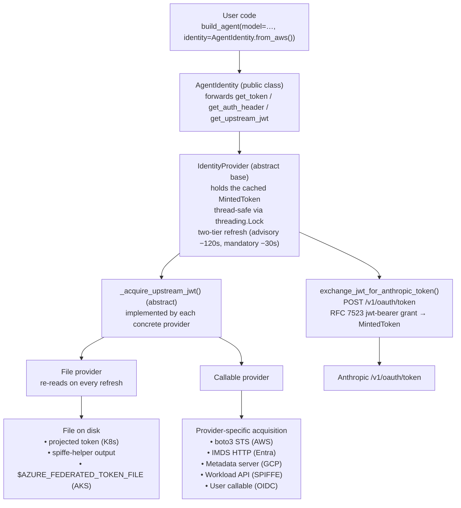
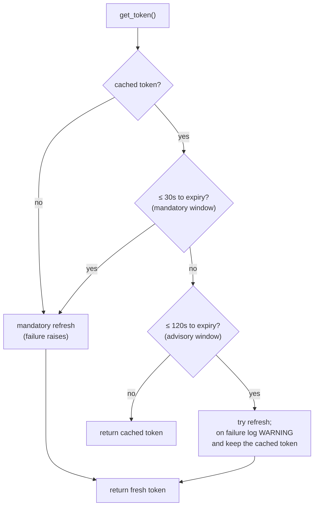

# Architecture

Agent Identity is a thin, layered subsystem. User code touches exactly one
class — `AgentIdentity` — and everything below it is a provider, a cache, and a
single RFC 7523 exchange call.

## Request path

The framework owns only two things: the **exchange step** and the **cache**.
Every provider uses the platform's native SDK or metadata service to obtain the
upstream JWT — nothing here re-implements an identity provider.

## Token lifecycle

A minted token is a small immutable record (`MintedToken`) carrying the access
token, its type, and a monotonic expiry. `get_token()` runs a two-tier refresh
under a `threading.Lock`, so concurrent callers collapse into a single exchange:

- **Mandatory window** (`MANDATORY_REFRESH_BUFFER_SECONDS` = 30s, or no token):
  a refresh is required; any failure propagates as
  [`TokenAcquisitionError`](security.md#errors) or `TokenExchangeError`.
- **Advisory window** (`ADVISORY_REFRESH_BUFFER_SECONDS` = 120s): a refresh is
  *attempted*; if it fails the still-valid cached token is returned and a
  warning is logged.

Expiry uses `time.monotonic()`, not wall-clock time, so the logic is immune to
clock skew and NTP steps. The cache is **process-local** by design — minted
tokens are never shared across processes (see [Security](security.md)).

## Auto-detection

`AgentIdentity.auto()` picks a provider from environment markers, in a fixed
precedence order, with **no metadata-server probe** (it is fast and works
offline):

| Order | Platform | Markers |
| --- | --- | --- |
| 1 | Entra | `AZURE_FEDERATED_TOKEN_FILE`, `AZURE_CLIENT_ID` |
| 2 | AWS | `AWS_LAMBDA_FUNCTION_NAME`, `AWS_EXECUTION_ENV`, `EKS_POD_NAME`, `AWS_WEB_IDENTITY_TOKEN_FILE` |
| 3 | GCP | `GOOGLE_CLOUD_PROJECT`, `K_SERVICE`, `GCE_METADATA_IP` |
| 4 | SPIFFE | `SPIFFE_ENDPOINT_SOCKET` |

If a workload sets markers for more than one platform, the first match wins. If
none match, `auto()` raises [`PlatformDetectionError`](security.md#errors)
naming the explicit `from_*` factories as the fallback.

## `build_agent()` integration

When you pass `identity=` to `build_agent()` with a **model id string**, the
agent's own Anthropic calls are authenticated with the federated token:

- The minted token is a *bearer* token, so it is placed in the `Authorization`
  header (`Authorization: Bearer sk-ant-oat01-…`); no `x-api-key` is sent.
- If `ANTHROPIC_API_KEY` is also set, `build_agent()` raises
  [`CredentialPrecedenceError`](security.md#errors) rather than let the static
  key silently shadow the federated identity.
- The identity is exposed as `agent.identity`, so MCP tools and downstream
  calls can mint authenticated headers with `agent.identity.get_auth_header()`.

The token is resolved when the model is built. A long-lived agent that outlives
the token lifetime should be rebuilt (or call `agent.identity.get_token()` for a
fresh token in its own outbound calls).

!!! note "Anthropic SDK versions"
    The integration injects the bearer token at the model-construction layer
    (via LangChain `init_chat_model`) because it works on the SDK versions
    Promptise targets today. If a future Anthropic SDK ships a first-class
    workload-identity credential type, the agent's own calls can move onto it
    without any change to the `AgentIdentity` public surface.

## Audit-log enrichment (integration contract)

When an `AgentIdentity` is attached to an agent, the Security Guardrails audit
log can stamp every entry with two extra fields:

- `identity.provider` — the provider's `provider_name` (e.g. `aws-sts`).
- `identity.service_account_id` — the federated service account id.

These are available from `agent.identity.provider_name` and
`agent.identity.service_account_id`. Wiring them into the audit-log writer is a
cross-subsystem change owned by Guardrails and is tracked as a follow-up; the
contract above is the integration point.
