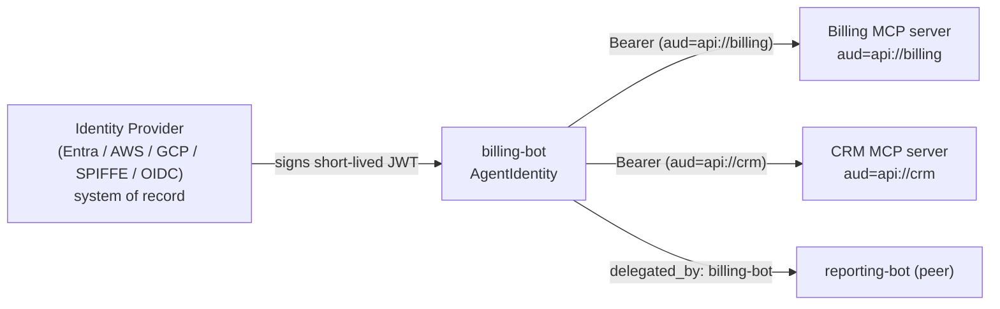

# Guide: End-to-end agent identity

This guide walks one realistic enterprise scenario from start to finish:
giving an autonomous agent a **non-human identity**, presenting it to the
internal services the agent calls, **verifying** it on those services,
and **attributing** every action — including work the agent delegates to a
peer — back to the agent that took it.

By the end you will have wired identity through all four touch points:
attribution, outbound auth, inbound verification, and audit.

---

## The problem

An autonomous agent acts on its own — it calls internal APIs, queries
databases through MCP servers, and hands work to other agents. That
raises questions a human SSO login was never designed to answer:

- **Who acted?** When something goes wrong, "the LLM did it" is not an
  answer. You need to know *which agent*, owned by *which team*, took the
  action.
- **How does it authenticate?** Internal MCP servers and APIs must not
  trust a self-asserted name. But minting a static API key per agent and
  hoping nobody leaks it is exactly the anti-pattern modern identity
  abandoned for humans.
- **How do you govern it?** You need to inventory agents, rotate their
  credentials, and *revoke* one instantly — from one place, not by
  redeploying every service that trusted it.

Microsoft's **Entra Agent ID**, AWS IAM roles, GCP service accounts, and
SPIFFE all answer this for non-human workloads: a directory issues each
workload a short-lived, signed credential, and that directory is the
system of record. Promptise's **Agent Identity** plugs an agent into
exactly that model — see [Overview](overview.md) for the concepts.

!!! info "Identity is not the model credential"
    This is about *who is acting*, not how the LLM call is authenticated.
    The model keeps its own API key; identity is orthogonal.

---

## The scenario

We will build `billing-bot`, an agent that:

1. is owned by the `payments` team and traceable across a fleet,
2. calls **two** internal MCP servers — a billing server and a CRM
   server — each of which requires a credential minted for *its* audience,
3. **delegates** a sub-task to a `reporting-bot` peer, and
4. records every action — its own and the delegated one — to an
   observability timeline and a tamper-evident server-side audit log.



---

## Part 1 — Give the agent an identity

Start local. A local identity needs no infrastructure and immediately
gives you fleet-wide attribution.

```python
from promptise import build_agent
from promptise.identity import AgentIdentity

identity = AgentIdentity(
    "billing-bot",
    name="Billing Bot",
    owner="payments",
    labels={"env": "prod", "team": "payments"},
)

agent = await build_agent(
    model="anthropic:claude-sonnet-4-5",
    servers={},
    identity=identity,
    observe=True,   # turn on the timeline so attribution is visible
)
```

Every tool call and LLM turn the agent records is now tagged
`agent_id="billing-bot"`.

When the agent needs to *authenticate* to a resource — not just be named
— make the identity **verifiable** by backing it with a credential
provider. Pick the factory for your platform (see the
[provider pages](overview.md#credential-providers)):

=== "Microsoft Entra"

    ```python
    identity = AgentIdentity.from_entra(
        "billing-bot", client_id="<managed-identity-client-id>"
    )
    ```

=== "AWS IAM"

    ```python
    identity = AgentIdentity.from_aws("billing-bot", region="us-east-1")
    ```

=== "Generic OIDC (CI, any IdP)"

    ```python
    identity = AgentIdentity.from_oidc(
        "billing-bot", issuer="https://gitlab.com", token_env_var="CI_JOB_JWT_V2"
    )
    ```

=== "Auto-detect"

    ```python
    identity = AgentIdentity.auto("billing-bot")   # picks the platform
    ```

A verifiable identity can derive its authoritative id **from the IdP**
rather than the string you pass — omit `agent_id` and read it from the
credential's `sub`/`oid` claim:

```python
identity.is_verifiable        # True
identity.subject()            # the IdP-assigned id (sub, or oid for Entra)
identity.idp_claims()         # {"sub": ..., "iss": ..., "aud": ...}
identity.resolve_identifier() # the value used for attribution
```

The identity persists because the **IdP** persists it — Promptise keeps
no registry of its own. To retire the agent, disable it in the directory;
its credentials stop validating everywhere at once.

---

## Part 2 — Present the identity to MCP servers (outbound)

`billing-bot` calls two servers. Each expects a credential whose `aud`
claim names *that* server. Declare the audience on each
[`HTTPServerSpec`](../core/config.md#httpserverspec) and Promptise mints a
resource-scoped credential per server — **from the one identity**:

```python
from promptise.config import HTTPServerSpec

agent = await build_agent(
    model="anthropic:claude-sonnet-4-5",
    identity=identity,
    observe=True,
    servers={
        "billing": HTTPServerSpec(url="https://billing.internal/mcp",
                                  audience="api://billing"),
        "crm":     HTTPServerSpec(url="https://crm.internal/mcp",
                                  audience="api://crm"),
    },
)
```

When you pass `identity=`, every server that has no `bearer_token` of its
own receives the agent's credential automatically, scoped to its
`audience`. An explicit per-server `bearer_token` always wins.

How `audience` is honoured depends on the provider — *active* providers
(Entra IMDS, AWS STS, GCP metadata, SPIFFE SDK) re-mint per audience;
*passive* sources (projected-token files, OIDC file/env) carry the fixed
audience the platform stamped. See
[Per-resource credentials](architecture.md#per-resource-credentials).

!!! warning "Fail-closed, never fail-silent"
    If the IdP is briefly unreachable when a credential is acquired, the
    build does **not** silently drop it: it logs a warning and connects
    unauthenticated, so a server that requires auth rejects the call. You
    learn about the misconfiguration from the rejection, not from
    mysterious unattributed access.

You can also present the credential by hand anywhere — an HTTP API, a
custom client:

```python
headers = identity.auth_header("api://billing")   # {"Authorization": "Bearer <jwt>"}
```

---

## Part 3 — Verify the identity on the server (inbound)

A credential is only worth something if the resource *checks* it. On the
server side, the Promptise MCP Server SDK verifies the agent's IdP token
against the IdP's published keys with
[`JwksAuth`](../mcp/server/auth-security.md#jwksauth) — no shared secret,
and key rotation needs no reconfiguration.

```python
from promptise.mcp.server import (
    MCPServer, AuthMiddleware, JwksAuth, RequireClientId, HasRole, AuditMiddleware,
)

server = MCPServer(name="billing")

# Verify tokens this IdP issued for THIS resource. `audience` is required:
# it stops an agent replaying a token minted for a different resource.
auth = JwksAuth.from_discovery(
    issuer="https://login.microsoftonline.com/<tenant>/v2.0",
    audience="api://billing",
)
server.add_middleware(AuthMiddleware(auth))

# Tamper-evident audit: each entry records the VERIFIED agent identity
# (subject / issuer / audience / roles) inside an HMAC chain.
server.add_middleware(AuditMiddleware(log_path="billing-audit.jsonl", signed=True))
```

Now authorize specific agents on specific tools. After verification, the
validated `sub` and claims are on `ctx.client`, so guards decide *which
agent* may do *what*:

```python
@server.tool(auth=True, guards=[RequireClientId("billing-bot", "reporting-bot")])
async def issue_refund(ctx, invoice_id: str, amount: float) -> str:
    # ctx.client.subject  -> the IdP id of the calling agent
    # ctx.client.issuer   -> the IdP that vouched for it
    return f"Refunded {amount} on {invoice_id}"

@server.tool(auth=True, guards=[HasRole("payments-admin")])
async def close_account(ctx, account_id: str) -> str:
    return f"Closed {account_id}"
```

End to end, the agent's IdP identity now flows from the directory,
through the agent, to the resource — verified cryptographically, never
self-asserted. See [`ClientContext`](../mcp/server/auth-security.md#clientcontext)
for every field the server sees.

---

## Part 4 — Attribution and cross-agent delegation

With `observe=True`, every tool call and LLM turn is already attributed to
`billing-bot` on the timeline (its `agent_id`, or its IdP `subject` when
no local handle was given). No extra wiring.

Delegation is where attribution usually breaks — work done "by the other
agent" loses its origin. Promptise keeps it intact. Wire a peer with
`cross_agents=` and the delegating identity rides along automatically:

```python
from promptise.cross_agent import CrossAgent

agent = await build_agent(
    model="anthropic:claude-sonnet-4-5",
    identity=identity,                     # billing-bot
    observe=True,
    servers={...},
    cross_agents={
        "reporting": CrossAgent(agent=reporting_bot, description="Builds reports"),
    },
)
```

When `billing-bot` calls the generated `ask_agent_reporting` tool, the
peer's observability timeline stamps **`delegated_by`** (the caller's
`claims()`) on every entry it records during that delegated call. So even
work `reporting-bot` performs is traceable back to `billing-bot` as the
originator — answering "who *caused* this?", not just "who ran it?".

---

## Part 5 — Lifecycle: rotation, expiry, revocation

Because the credential is a short-lived JWT from your IdP, the hard parts
are handled for you:

- **Rotation / expiry** — Promptise reads the JWT `exp` and re-acquires
  the credential as it nears expiry, caching one token **per audience**.
  A platform-rotated projected token (no decodable `exp`) is treated as
  always-stale and re-read every time, so in-place rotation is always
  observed. See [Credential lifecycle](architecture.md#credential-lifecycle).
- **Key rotation** — `JwksAuth` fetches the IdP's keys on demand and
  caches them; when the IdP rotates its signing keys, verification keeps
  working with no redeploy.
- **Revocation** — disable the agent's identity **in the IdP**. Its
  short-lived credentials stop validating at every resource as they
  expire, with no change to any server's configuration. This is the whole
  point of keeping the IdP as the system of record.

---

## Production checklist

- [ ] **Verifiable, not just local** — back the identity with a platform
      provider so resources can verify, not merely read, the caller.
- [ ] **One audience per resource** — set `HTTPServerSpec.audience` (and
      `JwksAuth(audience=…)`) per server; never accept a token minted for
      a different resource.
- [ ] **`audience` is set on every `JwksAuth`** — it is required; an
      unset audience would let an agent replay a token across resources.
- [ ] **Guards on sensitive tools** — `RequireClientId` / `HasRole` so
      *which* agent is authorized, not just *that* it authenticated.
- [ ] **Signed audit** — `AuditMiddleware(..., signed=True)` so "which
      agent did what" is tamper-evident.
- [ ] **Attribution on** — `observe=True` (or set `observer_agent_id`) so
      the timeline names the acting agent.
- [ ] **Govern in the IdP** — create, inventory, rotate, and revoke
      agents in the directory; Promptise holds no identity store.

---

## Next steps

- [Architecture](architecture.md) — how the identity is stamped, cached,
  and presented, including [per-resource credentials](architecture.md#per-resource-credentials).
- [Security](security.md) — the threat model, guarantees, and what a
  `subject()` does and does not prove.
- [Provider setup](overview.md#credential-providers) — per-platform
  configuration for Entra, AWS, GCP, SPIFFE, and generic OIDC.
- [MCP server auth](../mcp/server/auth-security.md) — the full server-side
  verification and authorization surface.
